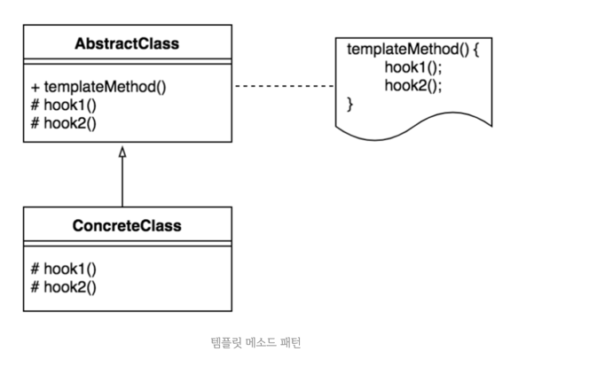

## Template Method Pattern ?

상속을 통해 슈퍼클래스의 기능을 확장할 때 사용하는 대표적인 방법이다.  
변하지 않는 기능은 슈퍼클래스에 만들어두고 자주 변경되며 확장할 기능은 서브클래스에서 재정의 할 수 있도록 하는 방법이다.
이 재정의하는 메서드를 훅 메서드라고 한다.

-> 템플릿 메서드 패턴은 전체적인 레이아웃을 통일하지만 상속받은 클래스는 훅 메서드를 이용해 확장할 수 있도록 유연성을 주는 디자인 패턴이라고 할 수 있다.

예제에서는 templateMethod() 가 move(), hook 메서드가 moveMotor() 이다.
