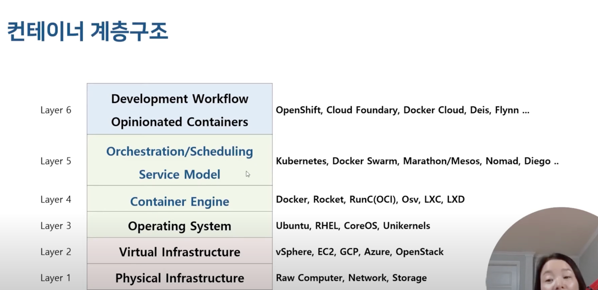

가상머신 : 기존에는 애플리케이션 리소스를 확장을 한다고 하면 수직적으로 리소스를 확장하여 한 가상머신 하나의 리소스를 업그레이드 했지만 
-> 이 경우 해당 애플리케이션이 다운되면 서비스를 못함
따라서 수직적으로 애플리케이션을 확장하여 구동중인 플랫폼이 다운되더라도 서비스 끊김 없이 대응할 수 있다.
또한 가상머신으로 환경을 구축할 경우 작은 애플리케이션을 구축하려고 해도 많은 리소스를 투입해야 한다.

스케일 업 보다 스케일 아웃.

[컨테이너 계층 구조]

## k8s 특징
- 워크로드 분리
- 어디에서나 실행 - 온프레미스, 퍼블릭 클라우드(AKS, EKS, GKE 등)
- 선언적 API
